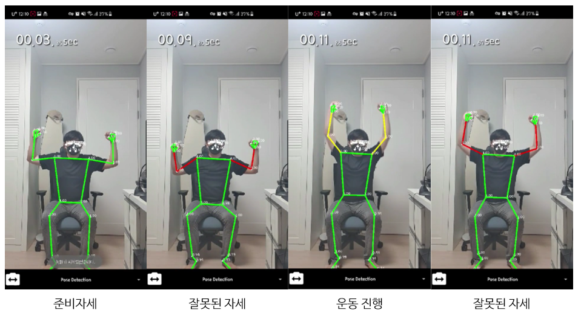
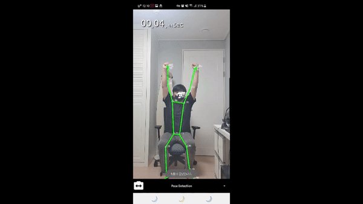
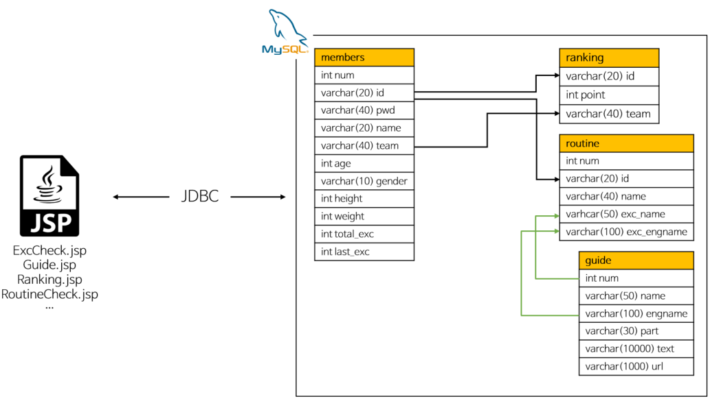

# IT's SMU-TEAM

### Sync Fit

Capstone Design (Graduate Project) at Sangmyung University 2021

### Project Member

| DEPT | ROLE                      | NAME   |
| ---- | ------------------------- | ------ |
| CS   | Deep Learning, PM, QA     | 이정휘 |
| CS   | Android Development PL,PE | 이재현 |
| CS   | Android Development PE    | 백지은 |
| CS   | UI Designer, Database PE  | 신연우 |
| CS   | Backend PL,PE             | 이안근 |

### History

[Commit](https://github.com/ITs-smu-Team/its-core-android/commits/master)

#### Skills

     

#### Implement List

[Github Wiki](https://github.com/ITs-smu-Team/its-core-android/wiki)

### Pose Detection

> Structure

위에 대한 코드는 [PoseGrahpic.kt](https://github.com/ITs-smu-Team/its-core-android/blob/d1cd9294d8575f53e26c2143cd80769aa170084a/Android/app/src/main/java/com/example/mlkit_pose/kotlin/posedetector/PoseGraphic.kt#L208) 에서 확인할 수 있습니다.

> Demo 

### Android

> Frontend

각 페이지는 [Fragment](https://github.com/ITs-smu-Team/its-core-android/tree/master/Android/app/src/main/java/com/example/mlkit_pose/fragment)로 구성되어 있습니다.

> Backend

AWS 클라우드 서버에서 구동되며 [JSP](https://github.com/ITs-smu-Team/its-core-android/tree/master/Server_JSP), Apache Tomcat 을 사용하여 개발을 진행하였음

### LICENSE

Apache License 2.0

> 위 라이센스는 MLKit 에 관한 License 입니다.

#### Reference

[Google MLKit](https://developers.google.com/ml-kit/guides)

